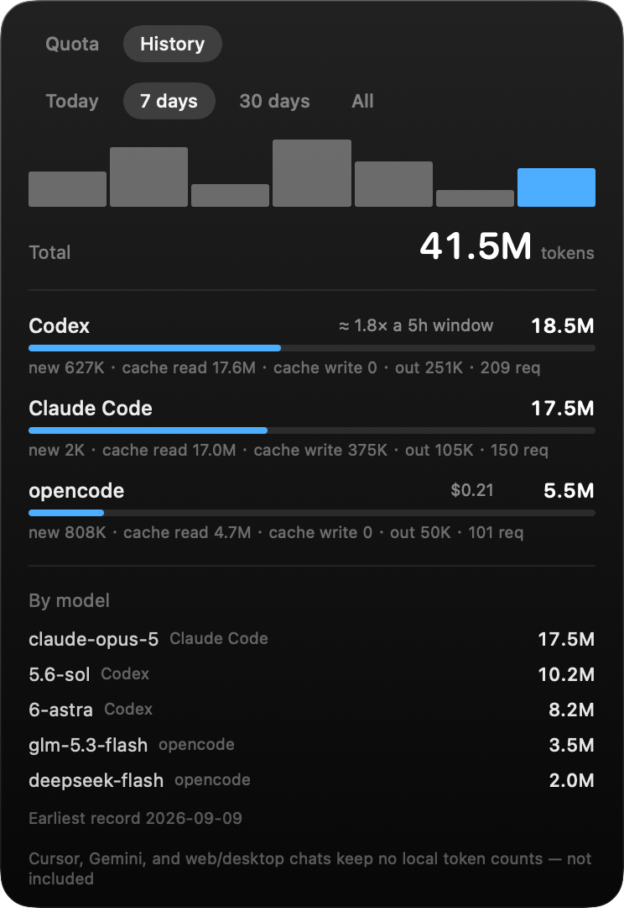

<div align="center">

# codex-cost

**Codex quota in your Mac's notch — and what your tokens would have cost on another model.**

[](#install)
[](Sources/)
[](LICENSE)
[](#privacy)


[中文说明](README.zh-CN.md)

</div>

---

Every Codex usage tracker answers *how much have I used*. This one answers the
two questions that actually change what you do next:

- **What is that spend made of** — new input, output, or the per-request floor?
- **What would the same work have cost on a different model?**

The second one needs a cost model. Getting one took **758 controlled API calls
across 35 experiment cells**, changing one variable at a time. The raw trials and
the harness are in [`research/`](research/).

## Install

```bash
git clone https://github.com/kongleiwork-art/codex-cost
cd codex-cost && ./build.sh && open CodexCost.app
```

Needs Xcode Command Line Tools (`xcode-select --install`). Nothing else — no
package manager, no account, no API key.

> The app is unsigned. On first launch: **right-click → Open → Open**.

## Features

|  |  |
|---|---|
| **Cost breakdown** | New input vs. output vs. per-request floor — see which one is actually draining you |
| **Counterfactual pricing** | The same tokens, priced on every model you could have used |
| **Both quota windows** | 5-hour and weekly, with reset countdowns |
| **Threshold alerts** | Notifies at 80% and 95% with burn rate, time left, and a cheaper model when one would help |
| **Cache expiry hint** | Come back to a large session after 10+ idle minutes and the panel shows what resuming costs if the cache has expired |
| **Menu-bar fallback** | Works on Macs without a notch |
| **Usage history** | A second tab totals tokens from Codex, Claude Code and opencode by day, tool and model — from local logs only |
| **Bilingual** | English / 中文, follows system language |

### Task routing (experimental, terminal only)

`cli/codex_route.py` suggests a model for a task: local keyword rules first, and
Luna only when the rules have nothing to go on.

```bash
python3 cli/codex_route.py --task "fix the flaky test" --json
python3 cli/codex_route.py --task "..." --no-luna   # local rules only
```

It is not wired into the app. A backtest over real Codex history
([`research/backtest_routing.py`](research/backtest_routing.py)) found nothing to
save: over 90% of quota went to sessions longer than 100 requests, the rules were
confident about only about a third of that spend, and following them would have
cost slightly more.

### Expensive-model nudge (experimental, install it yourself)

Recomputing that spend per turn showed the real problem is not *which* model to
pick — it is switching to the expensive one and forgetting to switch back. Over
30 days, astra turns reasoned a median of 199 tokens against sol's 1,445: the
expensive model was not being spent on the hard questions.

`cli/codex_model_hint.py` is a Codex `userPromptSubmit` hook. Before you send a
turn on an expensive model, it tells you what that turn is about to cost:

```
6-astra｜上下文 8.9 万｜这一轮约 2.7%，换 5.6-sol 约 0.7%（省 2.0%，按最近 3 次请求一轮估，未计输出）
```

It **never reads your prompt, calls no model, and does not block your message by
default** — it looks only at the current model and the session's context size. On
the reference model it stays silent, and any error exits quietly rather than
holding up your message. Gaps under 1% per turn say nothing (`CODEX_COST_HINT_MIN`
tunes that). Pass `--block` if you would rather be stopped until you switch.

The hook cannot change the model for that turn: Codex 0.155's protocol does not
allow it, and the main session's model can only be switched in the UI. So the
hook can only tell you to press the switch.

To install and remove it:

```bash
python3 cli/install_model_hint.py --dry-run    # print what it would write
python3 cli/install_model_hint.py              # install (backs up first)
python3 cli/install_model_hint.py --uninstall  # put it back
```

It touches only `~/.codex/config.toml`, appending one comment-delimited
`[[hooks.UserPromptSubmit]]` block, leaving everything else alone, backing the
file up first, and removing the whole block on uninstall. Repeat installs do not
stack.

(Codex also reads `hooks.json`, but only when migrating a Claude Code setup and
when a plugin ships one in its manifest. Writing to `~/.codex/hooks.json` gets
you nothing — it is never read. A user's own hooks belong in `config.toml`.)

Codex then asks you to **trust** the hook before it runs: the terminal client
prompts at startup, the desktop app lists it in settings. The installer never
trusts it for you.

### Usage history

The **History** tab adds up every token this Mac has a local record of — today,
7 days, 30 days or all time — split by tool and by model, with a daily bar chart.



| Source | Where it reads | Deduplication |
|---|---|---|
| Codex (CLI and desktop) | `~/.codex/sessions`, `~/.codex/archived_sessions` | timestamp + token counts — forked and archived sessions copy events verbatim |
| Claude Code | `~/.claude/projects` | message id, keeping the largest output — one reply is written several times as it streams, and resumed sessions copy it into new files |
| opencode | `~/.local/share/opencode/opencode.db`, opened read-only | message id; opencode's own dollar cost is shown as-is |

Codex totals are also converted to 5-hour-window equivalents with the coefficients
above; Claude Code and opencode are shown in tokens only. Some early Codex sessions
never recorded a model name; their tokens are listed as “Unknown model”.

Cursor keeps a `tokenCount` field locally but it is always zero, and Gemini CLI and
the ChatGPT / Claude chat apps keep no token counts at all — so they cannot be
included, and the panel says so.

Parsing is cached per file in `~/Library/Application Support/codex-cost/usage-index.json`
(the first scan of several GB takes about 15 seconds, later refreshes about one).
The index keeps records from files that have since been deleted, so history survives
Claude Code's 30-day transcript cleanup. Nothing is uploaded.

## What the measurements showed

**Cached input is cheap, not free — roughly 10× cheaper than fresh.** One percent
of the five-hour window buys ~36K fresh input tokens or ~364K cached ones, and the
cached cost grows in straight proportion to context size (20 requests each at
20K, 60K, 120K and 200K of context all land on one line). What you pay for, turn
after turn, is the context you keep re-sending.

**An expired cache costs nothing extra.** When the provider drops a conversation
from its cache, the next request reports the whole context as new input — but the
quota does not move any faster. A 39-request cell containing two such re-reads
moved the window 17%, which matches the 16.4% you get by pricing every request as
cached; pricing those two as fresh predicts 24%. codex-cost therefore bills a
re-read as cached, and the panel tells you what one more turn in this session
costs instead of warning about cache age. The re-reads themselves are easy to
see in the logs: idle for an hour and nine times in ten the next request reports
the whole context as new.

**Changing reasoning effort mid-session drops the cache.** Nearly half of the
re-reads that happen within five minutes of the previous request follow an effort
change. By the rule above it costs no extra quota — only latency.

**There is no measurable per-request floor on Sol.** `req/many` and `req/few` —
same cached total, 4× different request counts — solve it directly at
−0.012% ± 0.042%, and the joint fit puts it at zero. Earlier versions of this
README said 0.08%, then 0.03%: older cells sent thousands of fresh tokens with
every request, so the two could not be told apart. A tool loop is cheap if it
re-sends little; it is expensive when every turn drags a large context along.

**Effort is not charged at a premium — on Sol.** Higher effort costs more only
because it emits more reasoning tokens; across five levels the multiplier stayed
at 1.0 ± 0.1. In practice Sol at max effort still undercuts Astra at low effort,
so **turn the effort dial up before reaching for a bigger model.**

**Astra needs more than one number.** Relative to Sol its cached input costs
~2.8× and its output ~5.9×, and unlike Sol it has a real per-request floor
(0.22%), so any single "Astra is N×" figure shifts with how much the model talks.
A few substantial Astra requests are affordable; long reasoning chains and
chatty tool loops on it are not.

## Measured coefficients

Each model gets four coefficients instead of one multiplier:

| Model | New input per 1% | Cached input per 1% | Output + reasoning per 1% | Per request |
|---|---:|---:|---:|---:|
| `gpt-5.6-sol` | 35,646 tok | 364,295 tok | 13,859 tok | 0.0000% |
| `gpt-5.6-terra` | 35,646 tok | 364,295 tok | 13,859 tok | 0.0000% |
| `gpt-5.6-luna` | free | free | free | free |
| `gpt-6-astra` | 14,174 tok\* | 129,305 tok | 2,364 tok | 0.2239%\* |

Sol's four are fitted jointly on every Sol measurement with non-negative
least squares ([`research/refit.py`](research/refit.py)). Terra is
indistinguishable from Sol at this resolution and is scaled from it; gpt-5.5, an
older model, is no longer listed. \*Astra's
cached rate comes from a dedicated 120K-context cell; how the rest splits between
fresh input and the per-request floor is still loose (fresh anywhere from 25K to
80K fits almost equally well).

<details>
<summary><b>How this was measured, and where it's shaky</b></summary>

<br>

These numbers are only worth something if you know their error bars.

**Reliability, by model**

- **Sol is the best-measured model** — a joint fit over 164 regression points,
  RMS 0.39 against a 0.29 rounding floor. Every large-context cell lands within
  one point of its prediction (table below), and on your own logs the model comes
  within 1% of what the quota reading actually did: 9,994 intervals in which only
  one session was running, 4,922% observed against 4,970% predicted.
- **Terra is indistinguishable from Sol** at this resolution. Their error bars
  overlap; treat both as ≈1×.
- **Astra rests on 28 regression points; Luna on 30 calls.** Astra's cached rate
  is now measured rather than extrapolated, but its fresh-vs-per-request split is
  still soft. Read Luna, and that part of Astra, as order-of-magnitude.

**Known limits of the method**

- **Token counts are estimated** from the size of tool output, not billed
  figures. Use them for ratios, not accounting.
- **Quota readings are integers.** A cell measured over Δ=4% carries ±12%
  uncertainty from rounding alone; only large-Δ cells are trustworthy.
- **`max − min` systematically understates Δ** when a cell has few samples —
  and the expensive models are exactly the ones that run out of budget fastest.
  An early Astra estimate of 2.45× was wrong for this reason.
- **Windows run to 100% must be discarded.** The counter saturates while tokens
  keep flowing, so Δ is truncated.
- **Concurrency contaminates attribution.** Don't use Codex while measuring.

**Three things about the quota system itself**

- **Readings are event-driven.** The logs record a value only when Codex makes a
  request, so "current usage" is always as of the last request. After a window
  rolls over with no activity the last reading is stale — codex-cost detects this
  via `resets_at`. *Tools that skip that check will happily show you 99% on an
  empty window.*
- **The 5-hour limit is a rolling window, not a fixed one.** Usage going from 84%
  to 0% in 43 minutes appears in the data; a fixed window cannot do that, a
  rolling one can when a burst ages out together.
- **A reading lags one request.** The quota value returned with a request does
  not yet include that request's own cost; the next one does. Aligning the fit
  that way lowers its error for both Sol and Astra.

**How the coefficients got here — five versions**

1. **"Cached input is free."** Wrong, and wrong in the analysis rather than the
   data: resumed-session cells record *cumulative* token counts, and the analysis
   summed them across trials, inflating cached volume ~7×.
2. **677,444 tok/1%**, from a purpose-built cell — a 400KB seed, then 60
   one-word turns, Δ=24% — solved as a residual against the existing
   coefficients. Better, but those coefficients had been fitted with cached at
   zero, so the per-request term already absorbed part of the cache cost. Adding
   a cached term on top double-counted it: every cell came out over-estimated,
   by +0.85% on average.
3. **508,494 tok/1%**, from refitting all four coefficients jointly on all 481
   trials. Across 24 cells: MAE 0.87% → 0.66%, mean bias +0.85% → +0.32%. But
   its per-request floor (0.0819%) was inflated: in those trials fresh input and
   request count rose together, so the fit could trade one for the other.
4. **492,537 tok/1%.** Two new cell families broke that tie. `req/many` and
   `req/few` hold the cached total equal while request counts differ 4×; the
   difference alone solves the floor at −0.012% ± 0.042%. `ctx/*` fix 20 requests
   and sweep context from 20K to 200K; all four sit within rounding of one
   straight line. But cells that had suffered a cache miss still solved to ~550K
   while clean cells solved to ~370K.
5. **Current.** Two cells run back to back in one window reproduced that split
   exactly (15K-context cell 572K, 200K-context cell 370K), which ruled out a
   metering change. The difference is the re-read: subtracting it at the fresh
   price took too much off. Billing a re-read as cached collapses every cell onto
   the same rate and drops the fit error from 1.02 to 0.39, with the per-request
   floor at zero. A control cell run on 09-09 and again on 09-17 cost 0.211% per
   request both times, so metering itself has not moved.

|  | v4 | v5 (current) | observed |
|---|---:|---:|---:|
| `recheck/bigctx` — 39 requests, 2 re-reads | 18.6% | 16.7% | 17% |
| `recheck/ctx200k` — 19 requests at 200K | 8.5% | 10.6% | 11% |
| `ctx/200k` | 8.5% | 10.6% | 11% |
| `req/many` — 63 small requests | 10.6% | 9.2% | 9% |
| `cache/bigctx` | 25.4% | 24.1% | 24% |

v5 lands within one point on every one of them, and within 1% on real usage —
once you only count quota you can attribute. Run several Codex sessions at the
same time and the reading cannot say which of them spent what; measured over
those stretches, usage looks about 60% more expensive than any model predicts.
`research/intervals.py` reports the two cases separately: 0.99 when one session
is running, 1.63 when several are.

Version 3 came out of a second, independent pass over the data
([#1](https://github.com/kongleiwork-art/codex-cost/pull/1)). That pass ran on the
repo's copy of the trials, which was missing the 60 `cache/bigctx` rows — so it
concluded the cached rate was unidentifiable. With those rows restored, cached is
strongly identified: forcing it to zero raises the fit error from 0.49 to 3.11.

**Scope:** one account, Plus plan, September 2026. Metering can change — the
harness has a `control` cell for re-checking.

</details>

<details>
<summary><b>Command-line flags</b></summary>

<br>

```bash
open CodexCost.app --args --menubar    # force menu-bar mode
open CodexCost.app --args --expanded   # start with the panel open
./codex-cost --render panel.png        # render the panel offscreen to a PNG
./codex-cost --lang en                 # override the system language
./codex-cost --dump                    # print the numbers to stdout
```

The screenshots in this README are produced by `--render`, so they regenerate
from real data instead of being hand-captured.

</details>

## Privacy

Reads `~/.codex/sessions` locally. No network calls, no telemetry, nothing
uploaded. The panel shows aggregate numbers only — no prompts, no file contents.

## Repo layout

```
Sources/     the app — Swift, no dependencies
cli/         the same cost model as a terminal tool
tests/       fixture logs + regression tests for the app and the CLI
research/    the experiment harness and every raw trial
docs/        screenshots, regenerated from fixtures by docs/render.sh
```

## Contributing

Planned work and open decisions live in [docs/ROADMAP.md](docs/ROADMAP.md) (Chinese).
Measurements from other plans and accounts are the most useful thing you could
contribute — the coefficients here come from a single Plus account. Run
`research/quota_probe.py` and open an issue with the output.

Changing the log parser or the cost model? Run the tests first. They feed the
same fixture logs to the app and the CLI (both honor `CODEX_HOME`) and check
the expected numbers and that the two implementations agree — including the
case where the weekly quota is exhausted and Codex moves to a separate pool:

```bash
./build.sh && python3 tests/test_quota.py
```

## License

[MIT](LICENSE)
