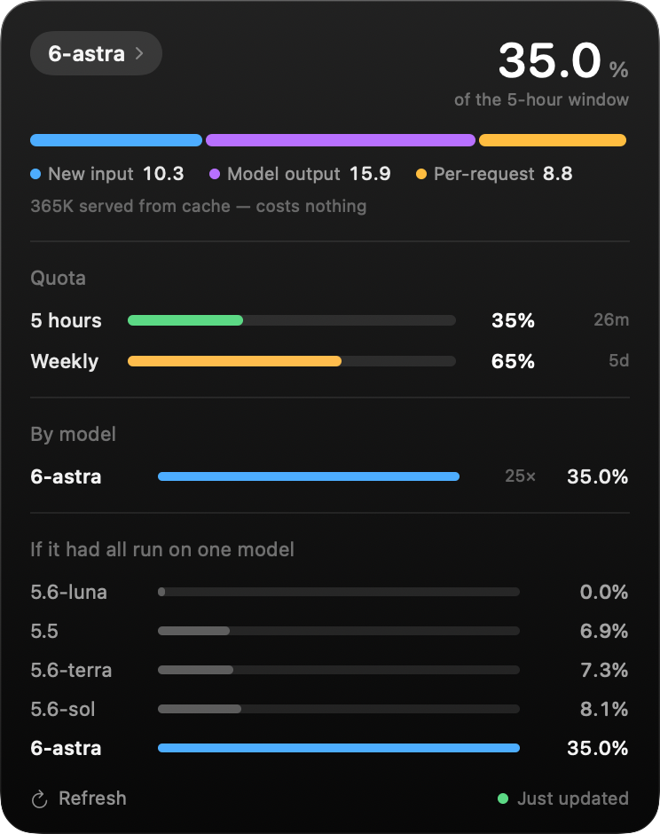

<div align="center">

# codex-cost

**Codex quota in your Mac's notch — and what your tokens would have cost on another model.**

[](#install)
[](Sources/)
[](LICENSE)
[](#privacy)



[中文说明](README.zh-CN.md)

</div>

---

Every Codex usage tracker answers *how much have I used*. This one answers the
two questions that actually change what you do next:

- **What is that spend made of** — new input, output, or the per-request floor?
- **What would the same work have cost on a different model?**

The second one needs a cost model. Getting one took **641 controlled API calls
across 32 experiment cells**, changing one variable at a time. The raw trials and
the harness are in [`research/`](research/).

## Install

```bash
git clone https://github.com/kongleiwork-art/codex-cost
cd codex-cost && ./build.sh && open CodexCost.app
```

Needs Xcode Command Line Tools (`xcode-select --install`). Nothing else — no
package manager, no account, no API key.

> The app is unsigned. On first launch: **right-click → Open → Open**.

## Features

|  |  |
|---|---|
| **Cost breakdown** | New input vs. output vs. per-request floor — see which one is actually draining you |
| **Counterfactual pricing** | The same tokens, priced on every model you could have used |
| **Both quota windows** | 5-hour and weekly, with reset countdowns |
| **Threshold alerts** | Notifies at 80% and 95% with burn rate, time left, and a cheaper model when one would help |
| **Menu-bar fallback** | Works on Macs without a notch |
| **Notch task entry** | Type a task at the top of the expanded panel; local rules (Luna if needed) pick a model once and open it in Terminal |
| **Bilingual** | English / 中文, follows system language |

### Task routing (local rules + Luna)

Type a task and a project folder at the top of the expanded panel. codex-cost
picks a model once and opens a new interactive Codex session on it in Terminal.

1. **Local rules first** (0 tokens), from the task text only: keywords, plus
   scope words like "everywhere" or "across". The state of your working tree is
   not used — twelve uncommitted files say nothing about how hard the next task is.
2. **Luna only when the rules have nothing to go on.** It reads the task text
   and answers one word; if that fails, the task goes to `sol`. Luna cost nothing
   in our measurements, so a failed judge costs time, not quota.
3. **No mid-session switch.** The prompt cache is per model; switching halfway
   re-bills the whole context as fresh input (~12× the cached price on Sol).
4. **Your own approval settings apply.** The session runs in Terminal like any
   Codex session you start yourself — no forced write access or auto-approval —
   so you can watch it and step in.

Preview a routing decision without starting anything:

```bash
python3 cli/codex_route.py --task "fix the flaky test" --json
python3 cli/codex_route.py --task "..." --no-luna   # local rules only
```

## What the measurements showed

**Cached input is cheap, not free — roughly 12× cheaper than fresh.** One percent
of the five-hour window buys ~42K fresh input tokens or ~490K cached ones, and the
cached cost grows in straight proportion to context size (20 requests each at
20K, 60K, 120K and 200K of context all land on one line). That is why long
sessions still add up: one real session carrying ~150K of context across 148
turns spent about half of its quota on cached input alone. *Still don't clear
context to save quota* — rebuilding it costs full fresh price, about 12× worse.
But a very long session is not free either.

**The per-request floor is small — what you pay for is what each request
carries.** ~0.03% on Sol, so about 30 near-empty requests make 1% of the
five-hour window. An earlier version of this README said 0.08%: older
experiments sent thousands of fresh tokens with every request, so the two could
not be told apart. Two cells built to separate them — same cached total, 4×
different request counts — put the floor near zero. A tool loop is cheap if it
re-sends little; it is expensive when every turn drags a large context along.

**Effort is not charged at a premium — on Sol.** Higher effort costs more only
because it emits more reasoning tokens; across five levels the multiplier stayed
at 1.0 ± 0.1. In practice Sol at max effort still undercuts Astra at low effort,
so **turn the effort dial up before reaching for a bigger model.**

**Astra needs more than one number.** Relative to Sol its fresh input costs
~2.9× and its output ~5.7× (its per-request floor looks like ~8×, but that
figure leans on an assumed cached rate), so any single "Astra is N×" figure
shifts with how much the model talks. Short, decisive Astra work is
affordable; long reasoning chains on it are not.

## Measured coefficients

Each model gets four coefficients instead of one multiplier:

| Model | New input per 1% | Cached input per 1% | Output + reasoning per 1% | Per request |
|---|---:|---:|---:|---:|
| `gpt-5.6-sol` | 42,500 tok | 492,537 tok | 13,572 tok | 0.0328% |
| `gpt-5.5` | 49,419 tok | 572,717 tok | 15,782 tok | 0.0282% |
| `gpt-5.6-terra` | 47,223 tok | 547,263 tok | 15,080 tok | 0.0295% |
| `gpt-5.6-luna` | free | free | free | free |
| `gpt-6-astra` | 14,545 tok | 168,559 tok\* | 2,364 tok | 0.2615%\* |

Sol's four are fitted jointly on all 641 measured calls with non-negative least
squares ([`research/refit.py`](research/refit.py)). 5.5 and Terra are
indistinguishable from Sol at this resolution and are scaled from it. \*Astra's
cached rate cannot be identified from the current data; it is set at Sol's
cached-to-fresh ratio, and Astra's per-request figure moves with that choice. A
dedicated `astra/bigctx` cell is defined but not yet run.

<details>
<summary><b>How this was measured, and where it's shaky</b></summary>

<br>

These numbers are only worth something if you know their error bars.

**Reliability, by model**

- **Sol is the best-measured model, but not settled** — a joint fit over 140
  regression points, RMS 0.84 against a 0.29 rounding floor, leave-one-out 0.87.
  The fit error sits well above the floor, and one real 148-request session is
  over-predicted (88% vs. 82%). The table below shows where each version lands.
- **5.5 and Terra are indistinguishable from Sol** at this resolution. Their
  error bars overlap; treat all three as ≈1×.
- **Astra and Luna rest on ~30–40 calls each.** Read them as order-of-magnitude.

**Known limits of the method**

- **Token counts are estimated** from the size of tool output, not billed
  figures. Use them for ratios, not accounting.
- **Quota readings are integers.** A cell measured over Δ=4% carries ±12%
  uncertainty from rounding alone; only large-Δ cells are trustworthy.
- **`max − min` systematically understates Δ** when a cell has few samples —
  and the expensive models are exactly the ones that run out of budget fastest.
  An early Astra estimate of 2.45× was wrong for this reason.
- **Windows run to 100% must be discarded.** The counter saturates while tokens
  keep flowing, so Δ is truncated.
- **Concurrency contaminates attribution.** Don't use Codex while measuring.

**Three things about the quota system itself**

- **Readings are event-driven.** The logs record a value only when Codex makes a
  request, so "current usage" is always as of the last request. After a window
  rolls over with no activity the last reading is stale — codex-cost detects this
  via `resets_at`. *Tools that skip that check will happily show you 99% on an
  empty window.*
- **The 5-hour limit is a rolling window, not a fixed one.** Usage going from 84%
  to 0% in 43 minutes appears in the data; a fixed window cannot do that, a
  rolling one can when a burst ages out together.
- **A reading lags one request.** The quota value returned with a request does
  not yet include that request's own cost; the next one does. Aligning the fit
  that way lowers its error for both Sol and Astra.

**How the coefficients got here — four versions**

1. **"Cached input is free."** Wrong, and wrong in the analysis rather than the
   data: resumed-session cells record *cumulative* token counts, and the analysis
   summed them across trials, inflating cached volume ~7×.
2. **677,444 tok/1%**, from a purpose-built cell — a 400KB seed, then 60
   one-word turns, Δ=24% — solved as a residual against the existing
   coefficients. Better, but those coefficients had been fitted with cached at
   zero, so the per-request term already absorbed part of the cache cost. Adding
   a cached term on top double-counted it: every cell came out over-estimated,
   by +0.85% on average.
3. **508,494 tok/1%**, from refitting all four coefficients jointly on all 481
   trials. Across 24 cells: MAE 0.87% → 0.66%, mean bias +0.85% → +0.32%. But
   its per-request floor (0.0819%) was inflated: in those trials fresh input and
   request count rose together, so the fit could trade one for the other.
4. **Current.** Two new cell families broke that tie. `req/many` and `req/few`
   hold the cached total equal while request counts differ 4×; the difference
   alone solves the floor at −0.012% ± 0.042%. `ctx/*` fix 20 requests and sweep
   context from 20K to 200K; all four sit within rounding of one straight line.
   Refitting everything, aligned to the one-request lag in quota readings, gives
   the table above.

|  | v3 | v4 (current) | observed |
|---|---:|---:|---:|
| `req/many` — 63 small requests | 12.7% | 10.6% | 9% |
| `req/few` — 15 large requests | 7.2% | 6.7% | 8% |
| `ctx/20k` | 2.5% | 1.7% | 1% |
| `ctx/200k` | 9.1% | 8.5% | 11% |
| `cache/bigctx` | 24.7% | 25.4% | 24% |
| a real 148-request session | 81.9% | 88.0% | 82% |

Neither version wins everywhere. v4 fixes the cells designed to separate the
floor from fresh input and halves the mean bias (+0.61 → +0.31 across 11
segments), but its segment MAE is slightly worse (0.99 → 1.13) and it misses the
real session by 6 points. Large contexts are under-predicted by both —
`ctx/200k` suggests cached input may cost more than the joint fit says, which the
older `cache/bigctx` cell does not show. That is the open question.

Version 3 came out of a second, independent pass over the data
([#1](https://github.com/kongleiwork-art/codex-cost/pull/1)). That pass ran on the
repo's copy of the trials, which was missing the 60 `cache/bigctx` rows — so it
concluded the cached rate was unidentifiable. With those rows restored, cached is
strongly identified: forcing it to zero raises the fit error from 0.49 to 3.11.

**Scope:** one account, Plus plan, September 2026. Metering can change — the
harness has a `control` cell for re-checking.

</details>

<details>
<summary><b>Command-line flags</b></summary>

<br>

```bash
open CodexCost.app --args --menubar    # force menu-bar mode
open CodexCost.app --args --expanded   # start with the panel open
./codex-cost --render panel.png        # render the panel offscreen to a PNG
./codex-cost --lang en                 # override the system language
./codex-cost --dump                    # print the numbers to stdout
```

The screenshots in this README are produced by `--render`, so they regenerate
from real data instead of being hand-captured.

</details>

## Privacy

Reads `~/.codex/sessions` locally. No network calls, no telemetry, nothing
uploaded. The panel shows aggregate numbers only — no prompts, no file contents.

## Repo layout

```
Sources/     the app — Swift, no dependencies
cli/         the same cost model as a terminal tool
tests/       fixture logs + regression tests for the app and the CLI
research/    the experiment harness and every raw trial
docs/        screenshots, regenerated from fixtures by docs/render.sh
```

## Contributing

Measurements from other plans and accounts are the most useful thing you could
contribute — the coefficients here come from a single Plus account. Run
`research/quota_probe.py` and open an issue with the output.

Changing the log parser or the cost model? Run the tests first. They feed the
same fixture logs to the app and the CLI (both honor `CODEX_HOME`) and check
the expected numbers and that the two implementations agree — including the
case where the weekly quota is exhausted and Codex moves to a separate pool:

```bash
./build.sh && python3 tests/test_quota.py
```

## License

[MIT](LICENSE)
