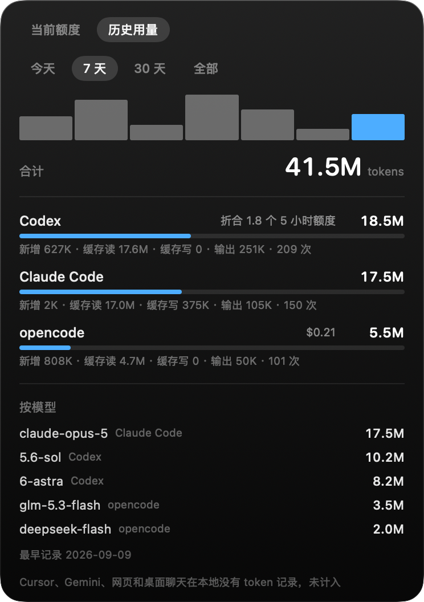

<div align="center">

# codex-cost

**把 Codex 额度放进 Mac 刘海 —— 顺便告诉你这些 token 换个模型要花多少。**

[](#安装)
[](Sources/)
[](LICENSE)
[](#隐私)


[English](README.md)

</div>

---

所有 Codex 用量工具都在回答"我用了多少"。这个回答的是另外两个——**会改变你下一步做法**的问题：

- **这笔花费的构成是什么** —— 新增输入、模型输出，还是每次请求的固定开销？
- **同样这些活，换个模型要花多少？**

第二个需要成本模型。为了拿到它，做了 **35 个实验组、758 次受控调用**，每次只改一个变量。原始数据和实验框架都在 [`research/`](research/)。

## 安装

```bash
git clone https://github.com/kongleiwork-art/codex-cost
cd codex-cost && ./build.sh && open CodexCost.app
```

只需要 Xcode 命令行工具（`xcode-select --install`）。没有包管理器、没有账号、没有 API key。

> 应用未签名。首次打开：**右键 → 打开 → 再点「打开」**。

## 功能

|  |  |
|---|---|
| **成本拆解** | 新增输入 / 模型输出 / 请求开销，看清到底是哪一项在烧 |
| **换模型对照** | 同样的 token，在每个可选模型上分别要花多少 |
| **两个额度窗口** | 5 小时和每周，带重置倒计时 |
| **阈值提醒** | 80% 和 95% 时通知，附燃烧速率、剩余时间，以及值得换的更便宜模型 |
| **缓存失效提示** | 大上下文会话空闲 10 分钟以上再回来时，提示缓存失效后接着用要花多少 |
| **菜单栏回退** | 没有刘海的 Mac 照样能用 |
| **历史用量** | 第二个标签页按天、工具、模型汇总 Codex、Claude Code、opencode 的 token —— 只读本地日志 |
| **中英双语** | 跟随系统语言 |

### 任务路由（实验性，仅命令行）

`cli/codex_route.py` 给任务建议一个模型：先跑本地关键词规则，规则完全没有依据时才问 Luna。

```bash
python3 cli/codex_route.py --task "fix the flaky test" --json
python3 cli/codex_route.py --task "..." --no-luna   # 只跑本地规则
```

它没有接进 app。拿真实的 Codex 历史回测（[`research/backtest_routing.py`](research/backtest_routing.py)）没有省下任何额度：90% 以上的额度花在超过 100 次请求的长会话里，规则有把握的只占其中约三分之一，照着规则换模型反而略多花。

### 贵模型提醒钩子（实验性，需自己安装）

按轮重算这个账之后，露出来的问题不是「该选哪个模型」，而是**切到贵模型之后忘了切回来**：近 30 天里 astra 的轮次推理 token 中位数是 199，sol 的是 1,445 —— 贵模型的钱没花在难题上。

`cli/codex_model_hint.py` 是个 Codex `userPromptSubmit` 钩子。你在贵模型上按回车之前，它会提示这一轮大概多花多少：

```
6-astra｜上下文 8.9 万｜这一轮约 2.7%，换 5.6-sol 约 0.7%（省 2.0%，按最近 3 次请求一轮估，未计输出）
```

它**不读提示词内容、不调任何模型、默认不拦你的消息**，只看当前模型和这段会话的上下文大小；在参照模型上完全静默；出任何错都静默退出，不挡消息。差距低于 1%/轮不吭声（`CODEX_COST_HINT_MIN` 可调）。要它直接拦下消息让你先切模型，加 `--block`。

钩子改不了这一轮的模型 —— Codex 0.155 的协议不允许，主会话的模型只有界面能换。所以它只能提醒你按一下。

装和卸：

```bash
python3 cli/install_model_hint.py --dry-run    # 先看它要往 hooks.json 写什么
python3 cli/install_model_hint.py              # 安装（写之前先备份）
python3 cli/install_model_hint.py --uninstall  # 还原
```

只动 `~/.codex/config.toml`：在文件末尾加一段用注释标记包起来的 `[[hooks.UserPromptSubmit]]`，别的内容一律不动，卸载整段删掉，写之前先备份。重复安装不会叠加。

（Codex 也认 `hooks.json`，但只在「从 Claude Code 迁移配置」和「插件自带清单」两处读它——往 `~/.codex/hooks.json` 写，它连读都不会读。用户自己的钩子归 `config.toml` 的 `[hooks]` 管。）

装完还要你**确认信任**这个钩子才会生效：终端版启动时弹 Hooks need review，桌面版在设置里。安装脚本不替你信任。

### 历史用量

「历史用量」标签页把这台 Mac 上所有有本地记录的 token 加起来，可选今天、7 天、30 天或全部，按工具和模型分项，附每日柱状图。



| 来源 | 读哪里 | 怎么去重 |
|---|---|---|
| Codex（命令行和桌面版） | `~/.codex/sessions`、`~/.codex/archived_sessions` | 时间戳 + 各项 token —— 分叉、归档的会话会原样复制事件 |
| Claude Code | `~/.claude/projects` | 消息 id，留输出最多的那遍 —— 一条回复在流式输出时会写好几遍，恢复的会话还会复制到新文件 |
| opencode | `~/.local/share/opencode/opencode.db`，只读打开 | 消息 id；opencode 自带的美元费用原样显示 |

Codex 的合计还会按上面的系数折合成「几个 5 小时额度」；Claude Code 和 opencode 只显示 token 数。有些早期的 Codex 会话日志里没记录模型名，这部分 token 列为「未知模型」。

Cursor 本地虽有 `tokenCount` 字段，但全是 0；Gemini CLI 和 ChatGPT / Claude 的聊天应用本地根本没有 token 记录 —— 所以没法计入，面板上会注明。

解析结果按文件缓存在 `~/Library/Application Support/codex-cost/usage-index.json`（首次扫几个 GB 的日志约 15 秒，之后刷新约 1 秒）。索引保留已被删除的文件的记录，所以 Claude Code 默认 30 天清理旧会话之后，历史照样在。不上传任何数据。

## 测出来的几件事

**缓存输入便宜，但不免费 —— 大约比 fresh 便宜 10 倍。** 1% 的 5 小时额度能买约 3.6 万 fresh token，或约 36 万缓存 token；而且缓存成本与上下文大小成正比（上下文 2 万、6 万、12 万、20 万各跑 20 次，四组落在一条直线上）。你一轮一轮付的钱，就是每轮重新发送的那段上下文。

**缓存过期不额外花钱。** 服务端把一段会话从缓存里丢掉后，下一次请求会把整段上下文报成新增输入，但额度并不会因此走得更快。一组 39 次请求、其中 2 次是这种重读的实验，实测消耗 17%：全部按缓存计价预测 16.4%，把那 2 次按新增输入计价则预测 24%。所以 codex-cost 把重读按缓存计价，面板也不再提示"缓存可能失效"，而是直接告诉你在这段会话里再问一轮大约花多少。重读本身在日志里很好认：空闲一小时后，十次里有九次下一个请求会把整段上下文报成新增。

**会话中途改推理强度会丢缓存。** 距上次请求不到 5 分钟就发生重读的情况里，将近一半紧跟在改推理强度之后。按上面的规则它不额外花额度，只是要多等一会儿。

**Sol 上测不出每次请求的固定底价。** `req/many` 与 `req/few` 缓存总量相同、请求数差 4 倍，直接解出底价为 −0.012% ± 0.042%，联合拟合给出的也是 0。这份 README 早先写过 0.08%、又写过 0.03%：旧实验每次请求都顺带几千 fresh token，两者分不开。**工具循环本身不贵，每一轮都拖着大上下文才贵。**

**effort 不额外加价 —— 在 Sol 上。** 调高档位变贵纯粹是因为产生了更多推理 token；五个档位测下来乘数稳定在 1.0 ± 0.1。实际上 Sol 开到 max 仍比 Astra 开 low 便宜，所以**先把 effort 拧满，再考虑换更贵的模型**。

**Astra 不能用一个倍数描述。** 相对 Sol，它的缓存输入贵约 2.8 倍、输出贵约 5.9 倍，而且和 Sol 不同，它有一个实打实的每请求底价（0.22%）—— 所以任何"Astra 贵 N 倍"的说法都会随模型说话多少而变。让它少量、成块地干活还行，让它写长推理、跑碎片化的工具循环不行。

## 实测系数

每个模型四个系数，而不是一个总倍率：

| 模型 | 每 1% 新增输入 | 每 1% 缓存输入 | 每 1% 输出+推理 | 每次请求 |
|---|---:|---:|---:|---:|
| `gpt-5.6-sol` | 35,646 tok | 364,295 tok | 13,859 tok | 0.0000% |
| `gpt-5.6-terra` | 35,646 tok | 364,295 tok | 13,859 tok | 0.0000% |
| `gpt-5.6-luna` | 免费 | 免费 | 免费 | 免费 |
| `gpt-6-astra` | 14,174 tok\* | 129,305 tok | 2,364 tok | 0.2239%\* |

Sol 的四个系数用全部 Sol 测量做联合非负最小二乘拟合（[`research/refit.py`](research/refit.py)）。Terra 在现有分辨率下与 Sol 分不出来，由 Sol 缩放而来；老模型 gpt-5.5 不再列出。\*Astra 的缓存费率由一组约 12 万上下文的专门实验定下；其余部分在 fresh 与每请求之间怎么分还不稳（fresh 从 2.5 万到 8 万拟合得几乎一样好）。

<details>
<summary><b>这些数字怎么测的，哪里不牢靠</b></summary>

<br>

这些数只有在你知道误差范围时才有价值。

**各模型的可信度**

- **Sol 测得最扎实** —— 164 个回归点联合拟合，RMS 0.39（舍入噪声下限 0.29）。每一组大上下文实验的预测都落在实测 1 个百分点以内（见下表）；拿你自己的日志回头对账也只差 1%：9,994 个「当时只开着一个会话」的区间，实测 4,922%、预测 4,970%。
- **Terra 在现有分辨率下与 Sol 分不出来**，误差棒重叠，两个都当 ≈1× 用。
- **Astra 有 28 个回归点，Luna 只有 30 次调用。** Astra 的缓存费率现在是实测的，不再靠外推；但它 fresh 与每请求的拆分仍不稳。Luna 和 Astra 的这一部分当数量级看。

**方法本身的局限**

- **token 数是估算的** —— 按工具返回内容的体积换算，不是账单数字。看比例，别对账。
- **额度读数是整数。** 一个只跑到 Δ=4% 的组，光舍入就带来 ±12% 误差；只有大 Δ 的组可信。
- **样本少时 `max − min` 会系统性低估 Δ** —— 而最贵的模型恰好最快撞预算、样本最少。早期把 Astra 测成 2.45× 就是栽在这里。
- **打满 100% 的窗口必须剔除。** 计数器停在上限而 token 继续涨，Δ 被截断。
- **并发会污染归因。** 测量期间不要同时用 Codex。

**关于额度系统本身的三个发现**

- **读数是事件驱动的。** 日志只在 Codex 发请求时才写，所以"当前用量"永远是上次请求那一刻的值。窗口滚动后如果没再用过，最后那条读数就是陈旧的 —— codex-cost 用 `resets_at` 识别这种情况。*不做这个检查的工具，会在空窗口上显示 99%。*
- **5 小时限额是滚动窗口，不是到点清零。** 数据里出现过 43 分钟内从 84% 掉到 0%，固定窗口做不到，滚动窗口在一批集中用量整体过期时可以。
- **读数滞后一次请求。** 一次请求带回来的额度读数还不包含它自己的费用，下一次才包含。按这个对齐拟合，Sol 和 Astra 的误差都更小。

**系数是怎么一步步定下来的 —— 五个版本**

1. **"缓存免费"**：错的，而且错在分析、不在数据。续会话的实验组记录的是**累计** token，分析代码却把它当每次增量又求和，缓存量虚增约 7 倍。
2. **677,444 tok/1%**：来自一组专门设计的实验（首轮塞 400KB，之后 60 次一个字的请求，Δ=24%），拿它对照已有系数做残差。好了一些，但那些已有系数是在"缓存按零"时拟合的，"每请求成本"里本来就吸收了一部分缓存成本 —— 再加一个缓存项等于重复计费，结果每一组都被高估，平均 +0.85%。
3. **508,494 tok/1%**：用全部 481 次试验把四个系数联合重拟合。24 组验证：MAE 0.87% → 0.66%，平均偏差 +0.85% → +0.32%。但它的每请求底价（0.0819%）是虚高的：那批实验里 fresh 输入和请求次数同涨同落，拟合可以拿一个顶另一个。
4. **492,537 tok/1%**：两类新实验打破了这种互相顶替。`req/many` 与 `req/few` 缓存总量相同、请求数差 4 倍，光看两者之差就解出底价为 −0.012% ± 0.042%；`ctx/*` 固定 20 次请求、上下文从 2 万扫到 20 万，四组都落在一条直线的舍入误差内。但凡是中途发生过缓存重读的实验组，仍然反解出约 55 万，干净的组只有约 37 万。
5. **当前版本**：同一个窗口里连着跑的两组复核实验，原样复现了这个分歧（15 万上下文那组 57 万，20 万那组 37 万），排除了计费口径变化。差别出在重读：按 fresh 价把它扣掉，扣多了。改成按缓存价计，所有实验组收敛到同一个费率，拟合误差从 1.02 降到 0.39，每请求底价为 0。对照组在 09-09 和 09-17 各跑一次，每次都是 0.211%，计费口径本身没变。

| | 第 4 版 | 第 5 版（当前） | 实测 |
|---|---:|---:|---:|
| `recheck/bigctx` —— 39 次请求，含 2 次重读 | 18.6% | 16.7% | 17% |
| `recheck/ctx200k` —— 20 万上下文 19 次 | 8.5% | 10.6% | 11% |
| `ctx/200k` | 8.5% | 10.6% | 11% |
| `req/many` —— 63 次小请求 | 10.6% | 9.2% | 9% |
| `cache/bigctx` | 25.4% | 24.1% | 24% |

第 5 版在每一组上都落在实测 1 个百分点以内，在真实使用上也只差 1% —— 前提是只算能归属的那部分额度。同时开着好几个 Codex 会话时，读数说不清是谁花的；只看那些时段，用量会显得比任何模型预测的都贵约 60%。`research/intervals.py` 把两种情形分开报：只有一个会话时比值 0.99，有并行会话时 1.63。

第 3 版来自对数据的第二轮独立核对（[#1](https://github.com/kongleiwork-art/codex-cost/pull/1)）。那一轮用的是仓库里的试验数据，而仓库那份漏了 `cache/bigctx` 的 60 条 —— 所以它得出"缓存费率不可辨识"。补回这 60 条后，缓存被强识别：强制缓存为零，拟合误差从 0.49 升到 3.11。

**适用范围：** 单个账号、Plus 套餐、2026 年 9 月。计量规则可能变 —— 实验框架里有个 `control` 组专门用来复检。

</details>

<details>
<summary><b>命令行参数</b></summary>

<br>

```bash
open CodexCost.app --args --menubar    # 强制菜单栏模式
open CodexCost.app --args --expanded   # 启动即展开
./codex-cost --render panel.png        # 离屏渲染面板到 PNG
./codex-cost --lang zh                 # 强制语言，不跟随系统
./codex-cost --dump                    # 把数字打到标准输出
```

README 里的截图就是 `--render` 出的，可以随时用真实数据重新生成，不用手动截屏。

</details>

## 隐私

只读本地 `~/.codex/sessions`。无网络请求、无遥测、不上传任何东西。面板只显示聚合数字 —— 不含 prompt，不含文件内容。

## 目录

```
Sources/     应用本体，Swift，零依赖
cli/         同一套成本模型的命令行版
tests/       固定样本日志 + app 与 CLI 的回归测试
research/    实验框架和全部原始试验记录
docs/        截图，由 docs/render.sh 从固定样本生成
```

## 参与

接下来的计划和待决定事项见 [docs/ROADMAP.md](docs/ROADMAP.md)。

**最有价值的贡献是来自其它套餐和账号的实测数据** —— 现在这套系数只来自一个 Plus 账号。跑一下 `research/quota_probe.py`，把结果开个 issue 贴上来就行。

改日志解析或成本模型之前先跑测试。它把同一批固定样本日志喂给 app 和 CLI（两边都认
`CODEX_HOME`），既核对期望值，也核对两份实现互相一致 —— 包括周额度打满、Codex 切到
独立额度池的情况：

```bash
./build.sh && python3 tests/test_quota.py
```

## License

[MIT](LICENSE)
