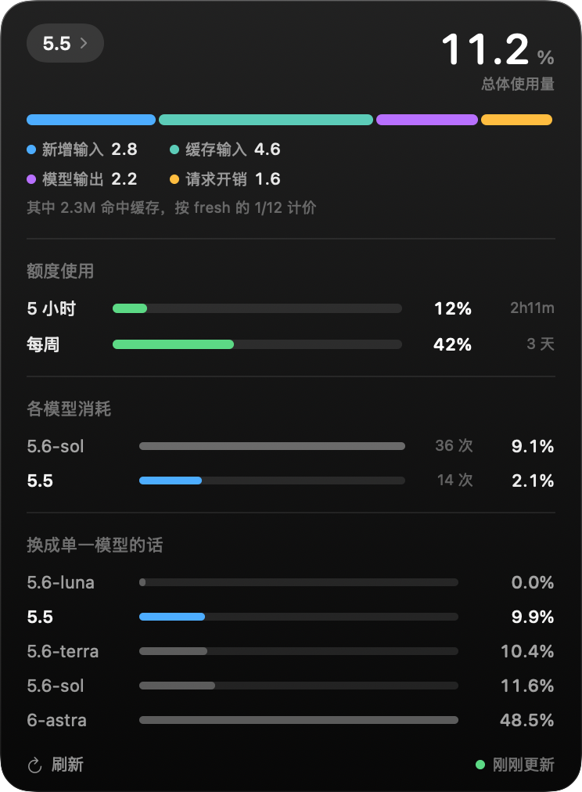

<div align="center">

# codex-cost

**把 Codex 额度放进 Mac 刘海 —— 顺便告诉你这些 token 换个模型要花多少。**

[](#安装)
[](Sources/)
[](LICENSE)
[](#隐私)



[English](README.md)

</div>

---

所有 Codex 用量工具都在回答"我用了多少"。这个回答的是另外两个——**会改变你下一步做法**的问题：

- **这笔花费的构成是什么** —— 新增输入、模型输出，还是每次请求的固定开销？
- **同样这些活，换个模型要花多少？**

第二个需要成本模型。为了拿到它，做了 **23 个实验组、421 次受控调用**，每次只改一个变量。原始数据和实验框架都在 [`research/`](research/)。

## 安装

```bash
git clone https://github.com/kongleiwork-art/codex-cost
cd codex-cost && ./build.sh && open CodexCost.app
```

只需要 Xcode 命令行工具（`xcode-select --install`）。没有包管理器、没有账号、没有 API key。

> 应用未签名。首次打开：**右键 → 打开 → 再点「打开」**。

## 功能

|  |  |
|---|---|
| **成本拆解** | 新增输入 / 模型输出 / 请求开销，看清到底是哪一项在烧 |
| **换模型对照** | 同样的 token，在每个可选模型上分别要花多少 |
| **两个额度窗口** | 5 小时和每周，带重置倒计时 |
| **阈值提醒** | 80% 和 95% 时通知，附燃烧速率、剩余时间，以及值得换的更便宜模型 |
| **菜单栏回退** | 没有刘海的 Mac 照样能用 |
| **中英双语** | 跟随系统语言 |

## 测出来的几件事

**缓存输入很便宜 —— 但多半不是免费。** 在受控实验里它从未显形：170 万缓存 token 只让计数器动了约 1%。但一个真实的 148 次请求会话（每轮扛着约 15 万上下文）实际烧了 82%，而模型只算出 48%，缺口大致对应**每 29 万缓存 token 消耗 1%**。合理的解释是：缓存有一个很低的费率，在短实验里被 ±0.5% 的舍入噪声淹没，只有长时间扛大上下文时才浮出来。**codex-cost 目前把缓存按零计价，所以会低估长会话、大上下文的消耗** —— 面板会把这个缺口显示成「估算偏差」，而不是藏起来。实用建议不变：别为了省额度清上下文，因为重建它要付全额 fresh 价。但"免费"这个说法太满了。

**每次请求都有底价。** Sol 上约 0.0667%，跟大小无关。也就是说约 15 次请求就吃掉 5 小时窗口的 1%，哪怕几乎什么都没返回。**冗余的工具循环即使很小也很贵。**

**effort 不额外加价 —— 在 Sol 上。** 调高档位变贵纯粹是因为产生了更多推理 token；五个档位测下来乘数稳定在 1.0 ± 0.1。实际上 Sol 开到 max 仍比 Astra 开 low 便宜，所以**先把 effort 拧满，再考虑换更贵的模型**。

**Astra 要用三个数描述，不是一个。** 它的输入、输出、请求底价相对 Sol 是三个不同的倍数，所以任何"Astra 贵 N 倍"的说法都会随着模型说话多少在 3× 到 11× 之间飘。让它干短平快的活还行，让它写长推理不行。

## 实测系数

每个模型三个系数，而不是一个总倍率：

| 模型 | 每 1% 的新增输入 | 每 1% 的输出+推理 | 每次请求 |
|---|---:|---:|---:|
| `gpt-5.6-sol` | 41,398 tok | 15,450 tok | 0.0667% |
| `gpt-5.5` | 48,137 tok | 17,965 tok | 0.0574% |
| `gpt-5.6-terra` | 46,000 tok | 17,167 tok | 0.0600% |
| `gpt-5.6-luna` | 免费 | 免费 | 免费 |
| `gpt-6-astra` | 15,415 tok | 2,495 tok | 0.3514% |

<details>
<summary><b>这些数字怎么测的，哪里不牢靠</b></summary>

<br>

这些数只有在你知道误差范围时才有价值。

**各模型的可信度**

- **Sol 可靠** —— 22 组实验，按次归一化回归 R² 0.987。
- **5.5 和 Terra 在现有分辨率下与 Sol 分不出来**，误差棒重叠，三个都当 ≈1× 用。
- **Astra 和 Luna 各只有 30–40 次样本**，当数量级看，别当精确值。

**方法本身的局限**

- **token 数是估算的** —— 按工具返回内容的体积换算，不是账单数字。看比例，别对账。
- **额度读数是整数。** 一个只跑到 Δ=4% 的组，光舍入就带来 ±12% 误差；只有大 Δ 的组可信。
- **样本少时 `max − min` 会系统性低估 Δ** —— 而最贵的模型恰好最快撞预算、样本最少。早期把 Astra 测成 2.45× 就是栽在这里。
- **打满 100% 的窗口必须剔除。** 计数器停在上限而 token 继续涨，Δ 被截断。
- **并发会污染归因。** 测量期间不要同时用 Codex。

**关于额度系统本身的两个发现**

- **读数是事件驱动的。** 日志只在 Codex 发请求时才写，所以"当前用量"永远是上次请求那一刻的值。窗口滚动后如果没再用过，最后那条读数就是陈旧的 —— codex-cost 用 `resets_at` 识别这种情况。*不做这个检查的工具，会在空窗口上显示 99%。*
- **5 小时限额是滚动窗口，不是到点清零。** 数据里出现过 43 分钟内从 84% 掉到 0%，固定窗口做不到，滚动窗口在一批集中用量整体过期时可以。

**未解问题：缓存输入到底多少钱**

受控实验和真实使用在这一点上差了约 6 倍。所有实验组都是小上下文；只有在"长时间扛着大上下文"的会话里才出现分歧。在那个场景被正经测过之前，模型把缓存按零计价，并把差额如实报出来，而不是掩盖。

**适用范围：** 单个账号、Plus 套餐、2026 年 9 月。计量规则可能变 —— 实验框架里有个 `control` 组专门用来复检。

</details>

<details>
<summary><b>命令行参数</b></summary>

<br>

```bash
open CodexCost.app --args --menubar    # 强制菜单栏模式
open CodexCost.app --args --expanded   # 启动即展开
./codex-cost --render panel.png        # 离屏渲染面板到 PNG
./codex-cost --lang zh                 # 强制语言，不跟随系统
./codex-cost --dump                    # 把数字打到标准输出
```

README 里的截图就是 `--render` 出的，可以随时用真实数据重新生成，不用手动截屏。

</details>

## 隐私

只读本地 `~/.codex/sessions`。无网络请求、无遥测、不上传任何东西。面板只显示聚合数字 —— 不含 prompt，不含文件内容。

## 目录

```
Sources/     应用本体，Swift，零依赖
cli/         同一套成本模型的命令行版
research/    实验框架和全部 421 次原始试验
docs/        渲染出的截图
```

## 参与

**最有价值的贡献是来自其它套餐和账号的实测数据** —— 现在这套系数只来自一个 Plus 账号。跑一下 `research/quota_probe.py`，把结果开个 issue 贴上来就行。

## License

[MIT](LICENSE)
